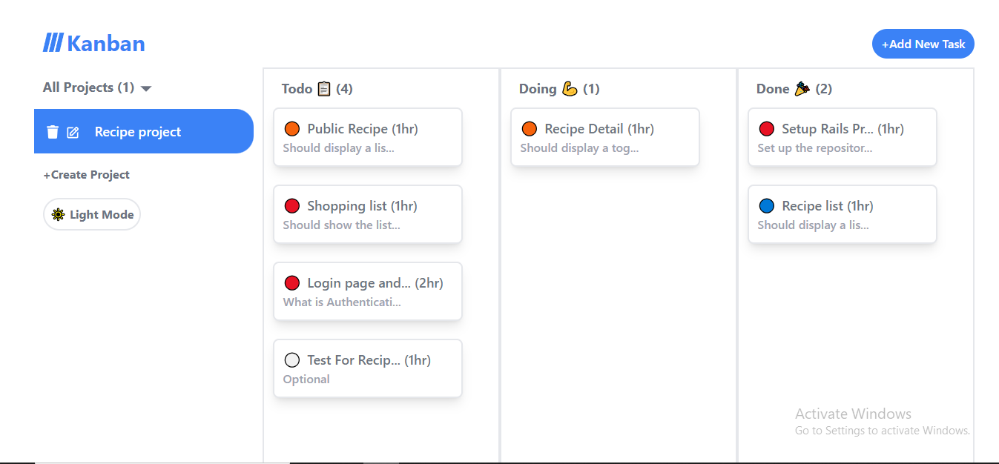

# Kanban board

Task-Management app

## Description

A fully-functional task management app built using React and Redux Toolkit. Including project creation, task addition, editing, and status updates (Todo, Doing, Done). With a sleek design and dark mode, effortlessly organize your tasks and projects while optimizing productivity.

## Getting Started
```
git clone git@github.com:Htetaungkyaw71/Kanban.git
```
### Screenshot


### Live demo

* Kanban
[@Link](https://kanban-ebon.vercel.app/)

### Technologies
* React
* Redux-toolkit
* Tailwind CSS

### Installing
```
 npm install
```

### Executing program

* How to run the program
```
npm run dev
```


## Authors

* Htetaungkyaw
[@Htetaungkyaw](https://github.com/Htetaungkyaw71)


## License

This project is licensed under the [NAME HERE] License - see the LICENSE.md file for details
